# ConsentMD - Architecture & System Diagrams

Comprehensive Mermaid diagrams showing system architecture, data flow, and interconnections.

---

## 1. System Architecture Diagram

---

## 2. Authentication Flow Diagram

---

## 3. Chat & Messaging Architecture

---

## 4. Clinical Scribe Workflow

---

## 5. MongoDB Data Model

---

## 6. AI Clinical Note Generation Flow

---

## 7. Notification Flow & Multi-Channel Distribution

---

## 8. Use Case Diagram - Clinical Scribe System

```mermaid
graph TB
    subgraph Users["Actors"]
        Doctor["👨‍⚕️ Doctor/Clinician"]
        Patient["👤 Patient"]
        System["🤖 AI System"]
    end

    subgraph UseCases["Use Cases"]
        UC1["Start Video Call"]
        UC2["Live Transcription"]
        UC3["Auto-Generate Note"]
        UC4["Select Consultation Type"]
        UC5["Link to Patient"]
        UC6["Edit & Finalize"]
        UC7["Share with Patient"]
        UC8["Generate Suggestions"]
        UC9["Send Notifications"]
    end

    Doctor -->|Initiates| UC1
    UC1 -->|Starts| UC2
    UC2 -->|Audio Input| System
    System -->|Generates| UC3

    Doctor -->|Selects| UC4
    Doctor -->|Chooses| UC5
    UC4 -->|Context for| UC3
    UC5 -->|Associates| UC3

    System -->|Creates| UC8
    UC8 -->|Suggests| UC6

    Doctor -->|Reviews & Edits| UC6
    Doctor -->|Finalizes| UC7
    UC7 -->|Notifies| Patient
    UC7 -->|Triggers| UC9

    UC9 -->|Delivered to| Patient
    UC9 -->|Delivered to| Doctor

    style Doctor fill:#e3f2fd
    style Patient fill:#f3e5f5
    style System fill:#fff9c4
    style UC1 fill:#c8e6c9
    style UC2 fill:#ffccbc
    style UC3 fill:#ffe0b2
    style UC4 fill:#b3e5fc
    style UC5 fill:#f8bbd0
    style UC6 fill:#dcedc1
    style UC7 fill:#c5e1a5
    style UC8 fill:#ffccbc
    style UC9 fill:#fce4ec
```

---

## 9. Message Processing Pipeline

---

## 10. Data Flow: Chat Message from Creation to Delivery

---

## 11. Google Cloud Infrastructure

---

## 12. Server-Side Event (SSE) vs WebSocket Decision

---

## 13. Data Consistency & Durability

---

## 14. Security & Authentication Layers

```mermaid
graph TB
    User["User Request"]

    User -->|HTTPS| TLS["TLS/SSL<br/>Encryption"]

    TLS --> CORS["CORS<br/>Validation"]

    CORS --> Auth["JWT<br/>Validation"]

    Auth --> Laravel{Check with<br/>Laravel?}

    Laravel -->|Optional| LaravelAPI["Call Laravel<br/>Verify Endpoint"]
    LaravelAPI -->|Valid| AuthPass["✅ Authorized"]
    LaravelAPI -->|Invalid| AuthFail["❌ Unauthorized"]

    Laravel -->|Direct| TokenSig["Verify Token<br/>Signature"]
    TokenSig -->|Valid| AuthPass
    TokenSig -->|Invalid| AuthFail

    AuthPass --> RBAC["Role-Based<br/>Access Control"]

    RBAC --> Resource["Access<br/>Resource"]

    Resource -->|Save/Update| Audit["Audit Log<br/>to MongoDB"]

    AuthFail --> Reject["Reject Request<br/>401/403"]

    style User fill:#e3f2fd
    style TLS fill:#c8e6c9
    style CORS fill:#bbdefb
    style Auth fill:#ffe0b2
    style AuthPass fill:#a5d6a7
    style AuthFail fill:#ffcdd2
    style RBAC fill:#f8bbd0
    style Resource fill:#b3e5fc
    style Audit fill:#e1bee7
```

---

**Note:** These diagrams are Mermaid-compatible. You can render them using:
- Mermaid Live Editor: https://mermaid.live
- GitHub (in README.md or .md files)
- Confluence, Notion, and other platforms with Mermaid support
- VS Code with Markdown Preview Enhanced extension

